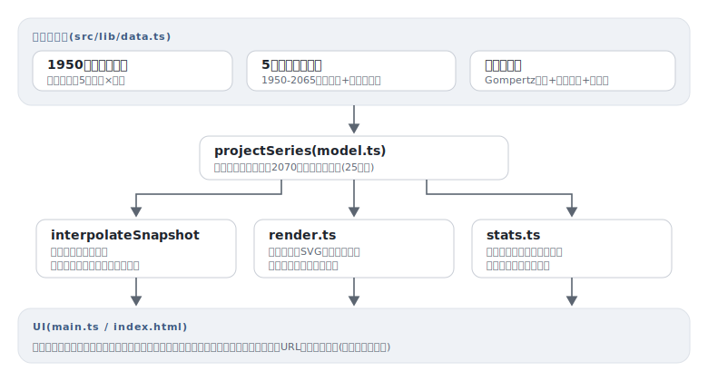

# jinkou

[](https://github.com/miruky/jinkou/actions/workflows/ci.yml)
[](https://github.com/miruky/jinkou/actions/workflows/deploy.yml)
[](https://www.typescriptlang.org/)
[](LICENSE)

**日本の人口ピラミッド120年分を、コーホート要因法で再構成して動かすアニメーションビューア**

デモ: https://miruky.github.io/jinkou/

## 概要

jinkouは、1950年から2070年までの日本の人口ピラミッド(5歳階級×男女)を時系列アニメーションとして眺めるWebアプリである。再生ボタンを押すと年が進み、ベビーブームの山が上へ移動しながら細り、ピラミッド型がつぼ型へ変わっていく様子を1本の動きとして観察できる。年スライダーでの行き来、再生速度の切替、任意の年へのURLハッシュ共有に対応する。

特徴はコーホート追跡で、ピラミッドの階級をクリックするとその出生世代に印が付き、年を動かしても同じ世代を追いかけられる。たとえば1945-50年生まれを選んで再生すれば、その山が70代へ登っていくのが一目で分かる。脇の指標パネルには総人口・三区分割合・老年人口指数が表示され、年とともに動く。

データは統計の生値ではない。1950年国勢調査の年齢構成、5年刻みの出生数、死亡率の年次改善という公表値を丸めた概数を入力に、コーホート要因法(加齢・死亡・出生の前進計算)で全時点を再構成している。2020年の総人口はモデル値1億2,400万人に対し実績1億2,615万人で、誤差はおよそ2%。高齢側の割合はモデルの粗さで実勢より数ポイント高めに出る。正確な統計が必要な用途には向かない。

### なぜ作ったのか

人口ピラミッドは統計サイトで年ごとの静止画としては見られるが、世代の塊が時間とともに移動していく「動き」こそがこのグラフの本質で、それを滑らかなアニメーションで追える道具が欲しかった。また、数百個の数値を貼り付ける代わりに少数の概数とモデルで全時点を導く構成にすれば、データの出所が明確になり、計算過程そのものをテストできると考えた。

## アーキテクチャ



## 技術スタック

| カテゴリ             | 技術                                    |
| :------------------- | :-------------------------------------- |
| 言語                 | TypeScript 5(strict、実行時依存ゼロ)    |
| ビルド               | Vite 6                                  |
| テスト               | Vitest(node環境、SVGは文字列として検証) |
| リンタ・フォーマッタ | ESLint(typescript-eslint)+ Prettier     |
| CI / 配信            | GitHub Actions / GitHub Pages           |

## 使い方

### 推移を計算する

```ts
import { projectSeries, snapshotStats, formatPopulation } from './lib';

const series = projectSeries(); // 1950-2070年、5年刻み25時点
const y2020 = series.snapshots.find((s) => s.year === 2020)!;
formatPopulation(snapshotStats(y2020).total); // => 1億2,403万人
```

`PyramidSnapshot` は `{ year, male: number[], female: number[] }`(千人単位、21階級)の素朴な形で、任意の実数年は `interpolateSnapshot(series, 1972.5)` で前後の時点から線形補間できる。

### ピラミッドを描く

```ts
import { renderPyramid, interpolateSnapshot } from './lib';

const svg = renderPyramid(interpolateSnapshot(series, 2020), { cohortStart: 1945 });
```

戻り値はviewBox指定のSVG文字列で、`cohortStart` を与えると該当世代の階級が強調される。軸の上限は全時点で固定しているため、年をまたいでも棒の長さを直接比較できる。アプリ本体は毎フレームの再描画はせず、`barRect` で座標を計算してrect属性だけを差分更新する。

### コーホートを追う

```ts
import { cohortStartOf, binOfCohort } from './lib';

const cohort = cohortStartOf(2020, 14); // 2020年に70-74歳 => 1945
binOfCohort(cohort, 1950); // => 0 (0-4歳)
binOfCohort(cohort, 2070); // => 20 (100歳以上に到達)
```

## プロジェクト構成

- `src/lib/data.ts` 初期人口・出生数・死亡モデルの概数パラメータ
- `src/lib/model.ts` コーホート要因法の前進計算と補間・コーホート逆算
- `src/lib/stats.ts` 三区分割合・老年人口指数と日本語表記
- `src/lib/render.ts` ピラミッドSVGの文字列生成
- `src/main.ts` 再生ループ・スライダー・コーホート追跡などのUI配線
- `docs/` アーキテクチャ図

## はじめ方

### 前提条件

- Node.js 22以上

### セットアップ

```bash
git clone https://github.com/miruky/jinkou.git
cd jinkou
npm ci
npm run dev
```

### テスト・lint・ビルド

```bash
npm test
npm run lint
npm run build
```

### デプロイ

mainへのpushで `deploy.yml` がGitHub Pagesへ公開する。サブパス配信のためのbaseは環境変数 `JINKOU_BASE` で渡す。

## 設計方針

- **数値の貼り付けではなくモデルで導く** — 入力は初期人口・出生数・死亡パラメータの3点に絞り、全時点を前進計算で得る。データの出所が追え、総人口や高齢化率が実勢の概形と合うことをテストで検証できる。
- **概算であることを隠さない** — 画面とREADMEの両方でモデル値と実績の差を明示し、統計の複製と誤解されないようにする。
- **軸を固定して時間比較を成立させる** — 軸の上限を全時点で共通にし、アニメーション中の棒の伸縮がそのまま人口の増減を意味するようにする。
- **描画は純関数、更新は差分** — SVG生成はDOM非依存の文字列組み立てとしてテストし、毎フレームはrect属性の更新だけで済ませる。
- **モーションは選べる** — 自動再生はせず、再生は明示的な操作で始める。`prefers-reduced-motion` では装飾アニメーションを無効化する。

## ライセンス

[MIT](LICENSE)
